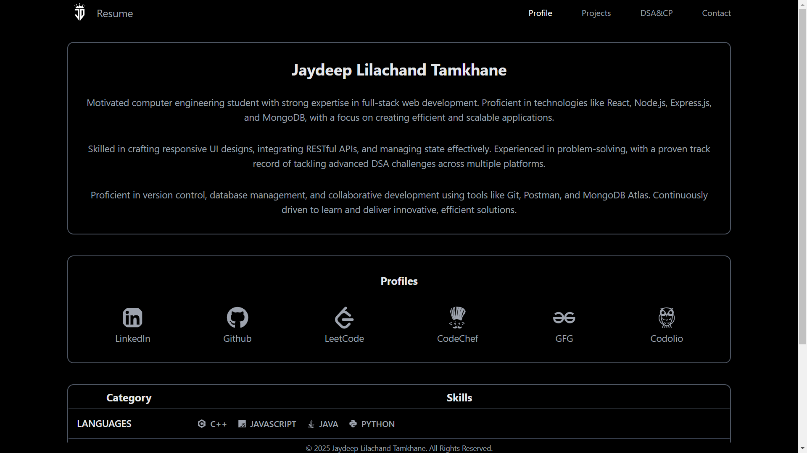
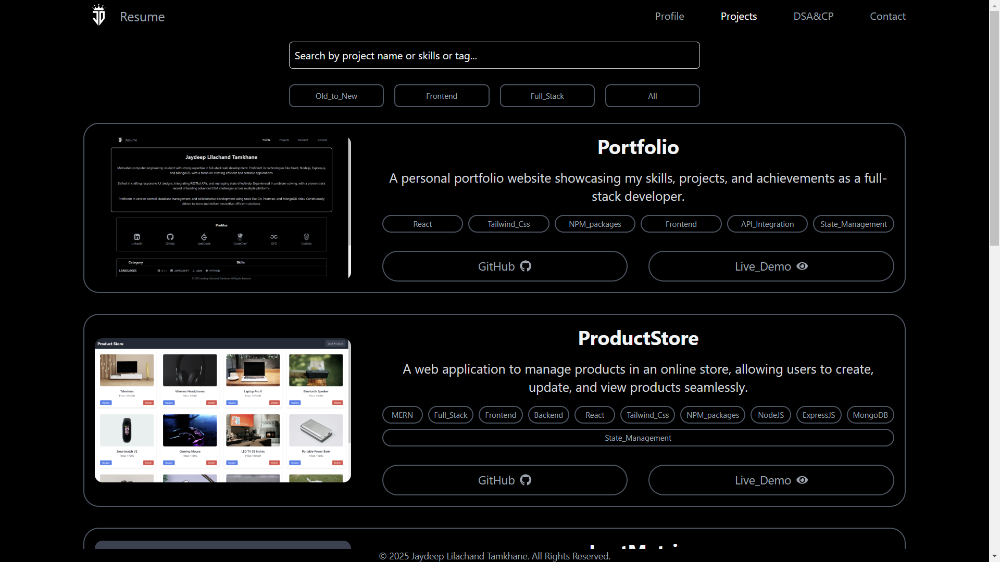
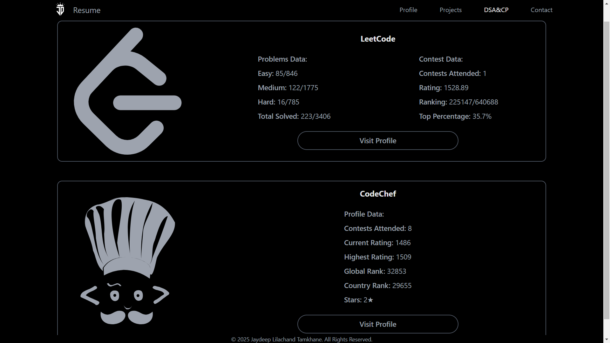
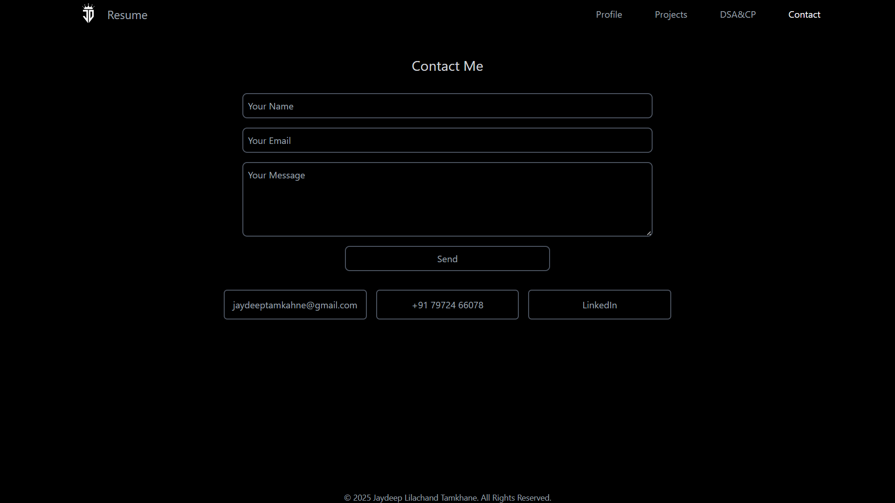

---

# Portfolio Website  

A **React.js** portfolio website showcasing personal projects, skills, and professional profiles. This application is designed to highlight your achievements and experience in a modern and interactive way. Built with a clean, responsive design using **Tailwind CSS**, the portfolio offers an intuitive user experience across devices.  

## Features  
- **Home Page**:  
  - Introduction section with a brief professional overview.  
  - Navigation bar for easy access to different sections.  
- **Projects Section**:  
  - Highlights key personal and professional projects with images and descriptions.  
- **DSA & CP Achievements**:  
  - Dedicated section showcasing competitive programming and data structure accomplishments, including platforms like LeetCode and CodeChef.  
- **Contact Form**:  
  - Users can reach out via a functional contact form.  
- **Skills Section**:  
  - Displays technical skills and proficiencies.  
- **Responsive Design**:  
  - Tailored for seamless usage on desktops, tablets, and mobile devices.  

---  

## Technologies Used  
### Frontend  
- **React.js**: Component-based library for building the user interface.  
- **React Router**: Enables smooth navigation between pages.  
- **Tailwind CSS**: Ensures a modern, responsive, and consistent styling framework.  

### Tools  
- **Vite**: For fast development and optimized production builds.  
- **Git & GitHub**: Version control and hosting the project repository.  

---  

## Folder Structure  

```plaintext  
Portfolio/  
├── public/                     # Publicly accessible files  
│   ├── JD_fevicon.png          # Favicon for the website  
│   └── resume/  
│       └── Jaydeep_Lilachand_Tamkhane_Resume.pdf  
│  
├── src/                        # Source code for the React project  
│   ├── assets/                 # Static assets like images  
│   │   ├── profile/  
│   │   │   ├── JD.jpg          # Profile picture  
│   │   │   └── Logo.png        # Website logo  
│   │   └── projects/  
│   │       ├── leetMetric.png  # LeetMetric project image  
│   │       ├── passBuilder.png # Password Builder project image  
│   │       ├── portfolio.png   # Portfolio project image  
│   │       ├── productStore.png # Product Store project image  
│   │       ├── studySync.png   # StudySync project image  
│   │       └── todoList.png    # TodoList project image  
│   │   └── readme_images/  
│   │       ├── ContactPage.png # Contact page image  
│   │       ├── DsaCpPage.png   # DSA & CP page image  
│   │       ├── ProfilePage.png # Profile page image  
│   │       └── ProjectsPage.png # Projects page image  
│   │  
│   ├── components/             # Reusable UI components  
│   │   ├── CodeChefCard.jsx    # Displays CodeChef stats  
│   │   ├── ContactForm.jsx     # Functional contact form  
│   │   ├── Footer.jsx          # Footer with contact info  
│   │   ├── IntroductionSection.jsx # Introductory section  
│   │   ├── LeetCodeCard.jsx    # Displays LeetCode stats  
│   │   ├── Navbar.jsx          # Navigation bar  
│   │   ├── ProfilesCard.jsx    # Social media and profile links  
│   │   ├── ProjectCard.jsx     # Individual project display  
│   │   └── Skills.jsx          # Skillset display component  
│   │  
│   ├── context/                # State management using Context API  
│   │   └── DataContext.jsx     # Manages global data  
│   │  
│   ├── pages/                  # Page-level components  
│   │   ├── Contact.jsx         # Contact page  
│   │   ├── DsaCp.jsx           # DSA & CP achievements page  
│   │   ├── Profile.jsx         # Profile or About Me page  
│   │   └── Projects.jsx        # Projects page  
│   │  
│   ├── App.jsx                 # Main React component managing routes  
│   ├── index.css               # Global CSS file  
│   └── main.jsx                # Entry point for the React app  
│  
└── package.json                # Dependencies and scripts  
```  

---  

## Installation and Setup  

### Prerequisites  
- [Node.js](https://nodejs.org/) installed on your system.  
- Basic knowledge of React.js and Tailwind CSS.  

### Steps  
#### 1. Clone the repository  
```bash  
git clone https://github.com/your-username/portfolio.git  
cd portfolio  
```  

#### 2. Install dependencies  
```bash  
npm install  
```  

#### 3. Run the development server  
```bash  
npm run dev  
```  
Navigate to `http://localhost:5173` to view the application in your browser.  

---  

## Screenshots  
### 1. Home Page  
A clean and professional landing page:  
  

### 2. Projects Section  
Showcases detailed project information:  


### 3. Dsa&Cp Section  
Showcases detailed DSA and CP information:  


### 4. Contact Page  
Functional form for user inquiries:  
  

---  

## Future Enhancements  
- **Dark Mode**: Add a toggle for light and dark themes.  
- **Animation**: Implement smooth animations for a modern feel.  
- **Dynamic Resume**: Allow users to download updated resumes.  
- **Testimonials Section**: Include client or peer reviews.  

---  

## Author  
**Jaydeep Tamkhane**  
- GitHub: [@JaydeepTamkhane](https://github.com/JaydeepTamkhane)  
- LinkedIn: [Jaydeep Tamkhane](https://www.linkedin.com/in/jaydeep-lilachand-tamkhane/)  

Feel free to fork this repository and contribute. 😊  

---